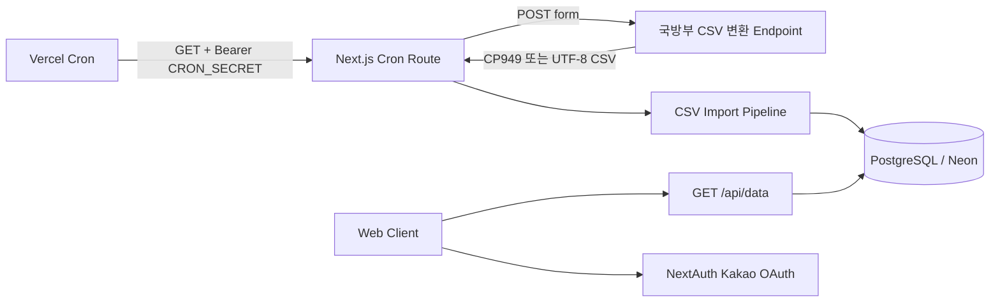
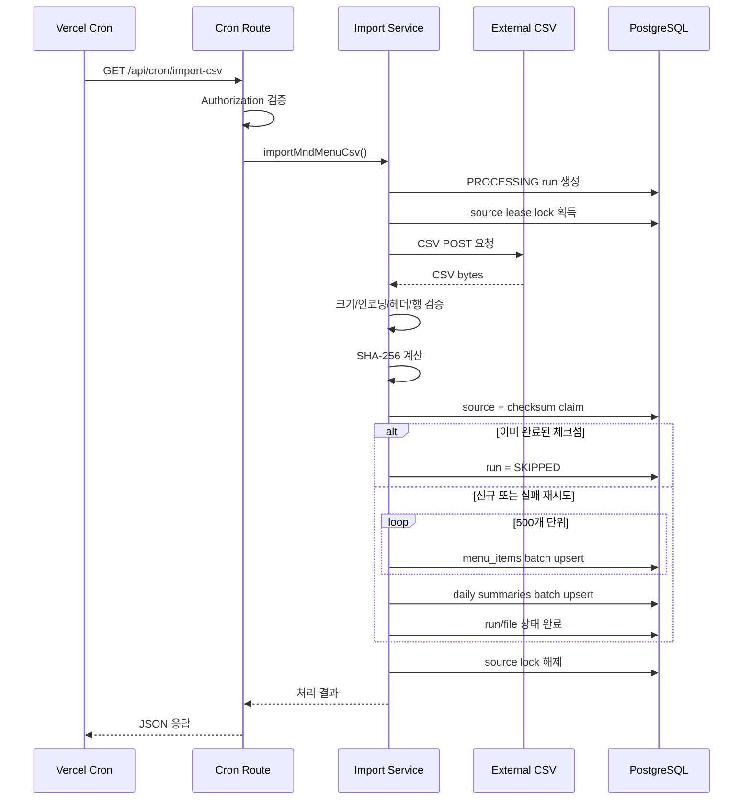
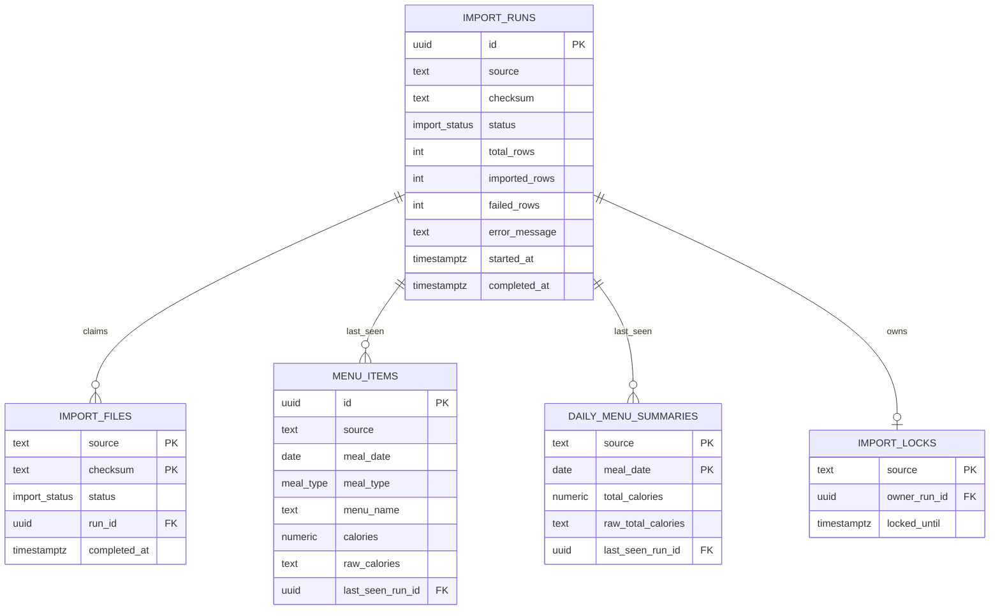
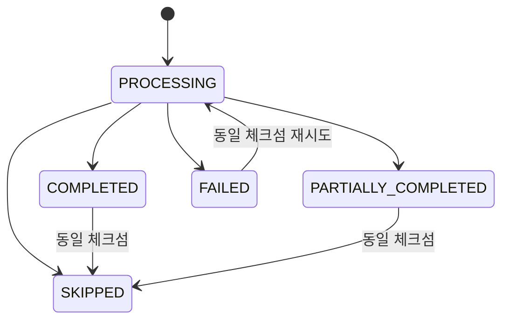

# CSV 식단 수집 아키텍처

## 1. 목적과 제약

이 서비스는 국방부 공개 데이터 `OA-9555`의 병영 식단을 제공한다. 정식 OpenAPI가 제공되지 않으므로 국방부 포털의 공식 CSV 변환 기능을 하루 한 번 호출하고, 파싱 결과를 PostgreSQL에 저장한다.

운영 제약:

- Next.js 애플리케이션 하나만 Vercel Hobby에 배포
- 별도의 상시 실행 백엔드 없음
- Vercel Cron은 하루 한 번만 실행
- Vercel 로컬 파일 시스템을 영구 저장소로 사용하지 않음
- Neon 무료 PostgreSQL 또는 기존 PostgreSQL 사용
- 운영 CSV를 Git에 저장하지 않음
- 원본 CSV 영구 보관은 현재 범위에서 제외

## 2. 시스템 컨텍스트



Cron과 조회 API는 모두 Next.js App Router의 Node.js Route Handler이다. 외부 CSV와 DB 자격 증명은 브라우저에 노출되지 않는다.

## 3. Import 처리 순서



실제 구현 순서:

1. `import_runs`에 `PROCESSING` 실행 생성
2. source별 15분 lease lock 획득
3. 외부 CSV 다운로드
4. 원본 바이트 SHA-256 계산
5. `import_files(source, checksum)` claim
6. UTF-8 또는 CP949/EUC-KR 디코딩
7. 필수 헤더 및 CSV 문법 검증
8. 날짜·열량 타입 변환
9. 잘못된 행을 제외하고 오류 정보 수집
10. 메뉴 업무 키 기준 메모리 중복 제거
11. 500개 단위 PostgreSQL upsert
12. 실행 상태 기록 및 lock 해제

## 4. 모듈 구조

```text
src/
├── app/api/
│   ├── cron/import-csv/route.ts   # Cron 인증 및 import 응답
│   ├── data/route.ts              # 공개 식단 조회 API
│   ├── auth/[...nextauth]/        # 카카오 OAuth
│   └── health/route.ts
└── lib/
    ├── auth/
    │   └── verify-cron.ts         # Bearer secret 검증
    ├── csv/
    │   ├── checksum.ts
    │   ├── decoder.ts
    │   ├── downloader.ts
    │   ├── errors.ts
    │   ├── parser.ts
    │   ├── validator.ts
    │   ├── types.ts
    │   └── sources/mnd-menu.ts    # OA-9555 POST form adapter
    ├── db/
    │   ├── client.ts
    │   ├── schema.ts
    │   └── repositories/
    │       ├── import-repository.ts
    │       └── menu-query-repository.ts
    └── import/
        ├── import-menu-csv.ts     # Import orchestration
        └── types.ts               # Repository port와 결과 타입
```

Route Handler는 인증과 HTTP 상태 변환만 담당한다. 다운로드, CSV 처리, DB 처리는 각각 독립 모듈로 분리되어 있다.

## 5. 데이터 모델



### 파일 unique key

```text
import_files(source, checksum)
```

원본 바이트의 SHA-256을 사용하므로 같은 파일은 한 번만 완료 처리된다. 같은 체크섬의 성공 또는 부분 성공 이력이 있으면 후속 실행은 `SKIPPED`다.

### 메뉴 unique key

```text
source + mealDate + mealType + menuName + rawCalories
```

원본에는 메뉴 ID나 행 순번이 없고 완전히 동일한 행이 반복된다. 따라서 조회 의미가 같은 메뉴를 위 조합으로 하나로 취급한다. 동일 메뉴라도 원본 열량 문자열이 다르면 별도 레코드로 유지한다.

## 6. Import 상태



- `COMPLETED`: 모든 행이 유효하고 DB 적재 성공
- `PARTIALLY_COMPLETED`: 일부 행을 제외하고 정상 행 적재
- `FAILED`: 다운로드, 파일 검증 또는 DB 처리 실패
- `SKIPPED`: 중복 체크섬 또는 동시 실행
- `PROCESSING`: 실행 중

## 7. 오류와 재시도

### 다운로드

- `cache: "no-store"`
- 기본 timeout 20초
- 최대 10MB
- Content-Length와 실제 stream 크기를 모두 확인
- HTTP 오류와 빈 파일 거부
- Content-Type만으로 CSV 여부를 판단하지 않음

### 파싱

- `csv-parse`를 사용해 quoted comma와 줄바꿈 처리
- UTF-8 BOM 제거
- UTF-8 디코딩 실패 시 CP949/EUC-KR 시도
- 헤더 누락 또는 CSV 문법 오류는 전체 실패
- 잘못된 날짜·열량 행은 제외하고 부분 성공
- 오류 메시지는 최대 10개 샘플로 요약

### DB

- 전체 파일을 하나의 긴 트랜잭션으로 묶지 않음
- batch upsert는 멱등
- 중간 실패 시 파일을 `FAILED`로 기록하고 같은 체크섬 재시도 허용
- 완전 성공에서만 stale 데이터 삭제
- 부분 성공·실패에서는 기존 데이터를 보존

### 동시 실행

source별 lease row를 atomic upsert한다. 기존 lock의 `locked_until`이 지나야 새 run이 소유권을 얻는다. 세션 유지가 필요한 advisory lock을 사용하지 않으므로 Neon pooled connection과 호환된다.

## 8. 조회 경로

```text
GET /api/data?page=1&pageSize=30&date=YYYY-MM-DD
```

반환 정보:

- 최신 날짜 우선 식단 목록
- page, pageSize, totalItems, totalPages
- 가장 최근 import 상태
- 마지막 성공 또는 부분 성공 완료 시각
- 데이터가 없으면 빈 배열

페이지 크기는 최대 100이다. 날짜는 실제 달력 날짜까지 검증한다.

## 9. 보안 경계

- Cron은 `Authorization: Bearer <CRON_SECRET>` 필요
- 비교에는 `timingSafeEqual` 사용
- DB URL과 OAuth secret은 서버 환경변수만 사용
- API 실패 응답에 stack trace나 DB 내부 메시지를 포함하지 않음
- DB의 `error_message`는 최대 2,000자
- CSV download URL과 OA-9555 식별자는 공개 정보이므로 source adapter에 포함 가능

## 10. 배포 구조

```text
Vercel Project
├── Next.js static/UI routes
├── Node.js Functions
│   ├── /api/cron/import-csv
│   └── /api/data
├── Vercel Cron: 0 0 * * *
└── Custom Domain
        │
        └── Neon pooled PostgreSQL
```

Cron 표현식은 UTC다. `0 0 * * *`는 한국시간 오전 9시 구간이며 Hobby 플랜에서는 실제 호출이 최대 약 59분 늦을 수 있다.

## 11. 확장 지점

- 원본 보관: downloader 결과를 받는 storage adapter와 Vercel Blob 추가
- 추가 CSV: `CsvSourceConfig`와 source adapter 추가
- 관리자 화면: `import_runs` 조회 API 추가
- 데이터 정제: 비정상 단위를 별도 품질 테이블에 저장
- 통합 테스트: 임시 PostgreSQL을 사용한 migration 및 실제 SQL 검증
